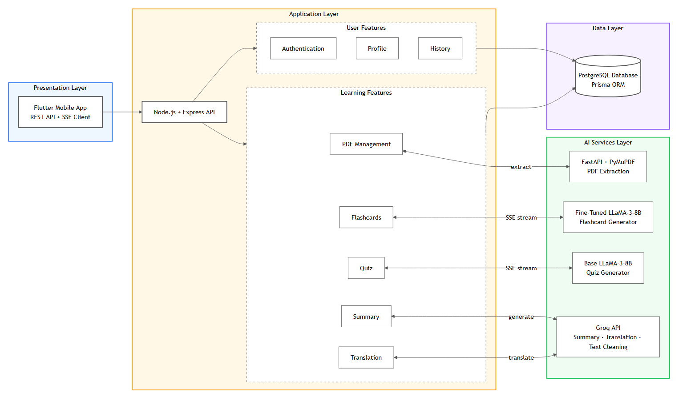
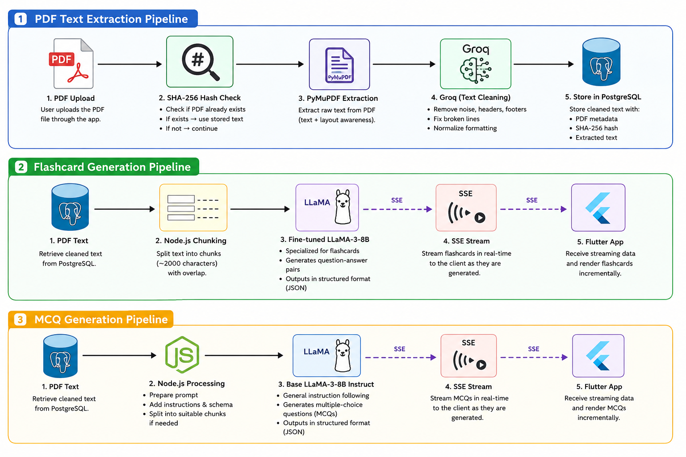
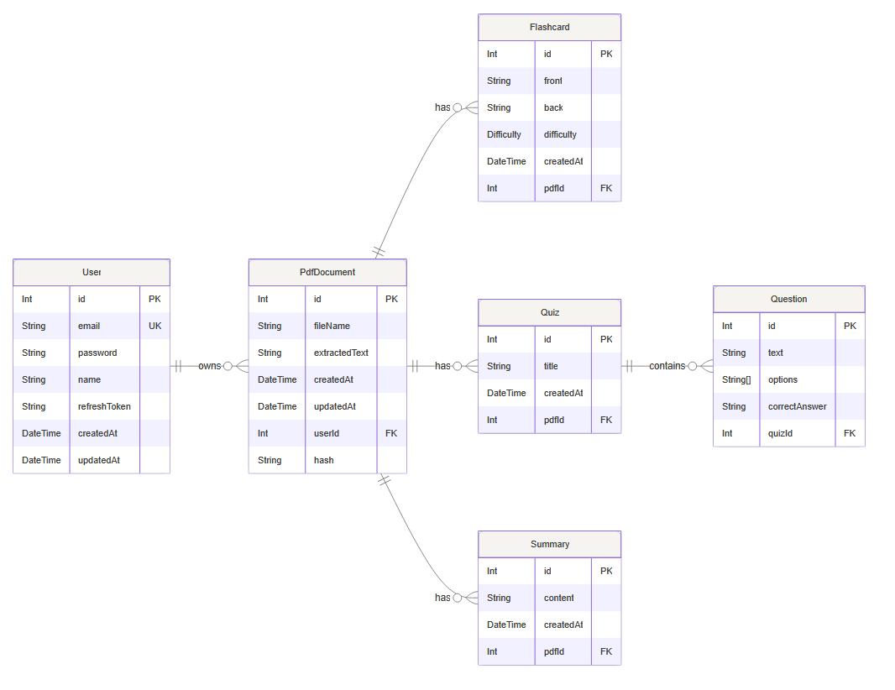

<div align="center">

# Smart Study Buddy — Backend

**AI-powered study assistant — transforms lecture PDFs into flashcards, quizzes, summaries & Arabic translations.**

[](https://nodejs.org)
[](https://expressjs.com)
[](https://postgresql.org)
[](https://prisma.io)
[](https://python.org)
[](https://fastapi.tiangolo.com)
[](https://docker.com)
[](https://groq.com)
[](LICENSE)

</div>

---

## Overview

Smart Study Buddy is an AI-powered graduation project that helps students study more effectively. Given a lecture PDF, the system automatically generates:

- **Flashcards** — Q&A pairs with difficulty levels (Easy / Medium / Hard), generated by a fine-tuned LLaMA-3-8B model
- **MCQ Quiz** — Multiple-choice questions with shuffled options and full document coverage
- **Summary** — Structured academic summary exportable as a styled PDF
- **Translation** — Real-time Arabic translation of any selected text
- **History** — Unified activity feed tracking all generated content
- **Profile Management** — Update name, change password, delete account

All flashcards and MCQs are delivered via **Server-Sent Events (SSE)** so the user sees content appearing progressively in real time.

---

## Architecture



### Key Design Decisions

- **Docker Compose** runs 3 services: Node.js API + PostgreSQL + Python extraction — one command starts everything
- **Colab AI models** load LoRA adapters from Hugging Face Hub [Hugging Face Hub](https://huggingface.co/Kemoooooz/smart-study-buddy-ai)
- **ngrok static domain** keeps the backend URL stable between sessions
- **Service Registry** — Colab self-registers its ngrok URL in the backend at startup via `POST /api/internal/register-service`
- **SSE streaming** — flashcards and MCQs stream to Flutter progressively as they are generated

### Core Pipelines




## Tech Stack

| Layer | Technology | Purpose |
|---|---|---|
| Runtime | Node.js 22.x | Backend server |
| Framework | Express 5.x | REST API framework |
| ORM | Prisma 5.x | Database access & migrations |
| Database | PostgreSQL 16 | Persistent data storage |
| Auth | JWT (access + refresh) | Stateless authentication |
| AI — Summary & Translation | Groq `llama-3.3-70b-versatile` | LLM inference |
| AI — Flashcards | Fine-tuned LLaMA-3-8B (Unsloth) | Educational Q&A generation |
| AI — MCQ | Base LLaMA-3-8B Instruct (Unsloth) | Multiple-choice questions |
| AI — PDF Cleaning | Groq + PyMuPDF | Text extraction & cleanup |
| Streaming | Server-Sent Events (SSE) | Real-time content delivery |
| Python Service | FastAPI + Uvicorn | AI microservice runtime |
| Containerization | Docker Compose | One-command local setup |
| Tunneling | ngrok | Expose backend to Colab |

---

## Database Schema



All records cascade-delete when their parent is removed.

---

## Project Structure

```
smart-study-buddy-backend/
│
├── src/
│   ├── app.js
│   ├── server.js
│   ├── config/
│   │   ├── env.js
│   │   └── service.registry.js
│   ├── prisma/
│   │   └── client.js
│   ├── middleware/
│   │   ├── authenticate.js
│   │   ├── errorHandler.js
│   │   └── notFound.js
│   ├── utils/
│   │   ├── ApiError.js
│   │   └── ApiResponse.js
│   └── modules/
│       ├── auth/
│       ├── pdf/
│       ├── flashcard/
│       ├── mcq/
│       ├── summary/
│       ├── translation/
│       ├── profile/
│       ├── HistoryFeature/
│       └── internal/
│
├── prisma/
│   └── schema.prisma
│
├── ai-service/
│   ├── app.py
│   └── requirements.txt
│
├── docker-compose.yml
├── Dockerfile
├── .env.example
└── README.md
```

---

## AI Services

### Flashcard Generation — Google Colab

[](https://colab.research.google.com/drive/1bksh9UbKqJ-tvhWzO6KKPux4v6feYZ0h?usp=sharing)

Fine-tuned **LLaMA-3-8B** with LoRA adapters loaded from [Hugging Face Hub](https://huggingface.co/Kemoooooz/smart-study-buddy-ai). Uses an Alpaca-format prompt with weighted difficulty distribution (40% Easy, 40% Medium, 20% Hard) and 2-strategy JSON extraction fallback. Self-registers its ngrok URL in the backend at startup.

```
POST /generate-flashcard
Body: { "context": "...", "total_length": 0 }
```

### MCQ Generation — Google Colab

[](https://colab.research.google.com/drive/1bksh9UbKqJ-tvhWzO6KKPux4v6feYZ0h?usp=sharing)

Base **LLaMA-3-8B Instruct** with continuous 100% document coverage chunking. Shuffles option order per question to remove answer-position bias. Supports both regular and SSE streaming endpoints.

```
POST /generate-mcqs
POST /generate-mcqs-stream
Body: { "context": "...", "total_length": 0, "limit": 20 }
```

### PDF Extraction — Docker (local)

**FastAPI + PyMuPDF + Groq** — runs inside Docker as the `ai-service` container. Extracts raw text from PDFs and cleans it via Groq before storing in PostgreSQL.

```
POST /extract
Body: multipart/form-data → file: <PDF>
```

### Summary & Translation — Groq API

Direct calls from Node.js to **Groq `llama-3.3-70b-versatile`**. Summary uses a structured markdown prompt parsed into sections (main topic, key concepts, important details, conclusion). Translation supports up to 5000 characters and returns Arabic text only.

---

## Try It Out

### 1. Run the AI Service (Colab)
> ⚠️ Required first — the app's AI features (flashcards, MCQs) won't work without this running.

[](COLAB_LINK_HERE)

Open the notebook → Run All. You'll know it's ready when you see:
```
INFO:     Uvicorn running on http://0.0.0.0:8000
```

### 2. Download the App
| Platform | Link |
|---|---|
| Mobile | [Download](https://drive.google.com/drive/folders/1uK1NRSc05UblOUeD_8bwBeVsUf8q621I?usp=drive_link) |

---

## Getting Started (Developers)

### Prerequisites

| Tool | Purpose |
|---|---|
| Docker Desktop | Runs API + DB + Python service |
| ngrok | Exposes backend to Colab |
| Google Colab | Runs the AI models (GPU) |

### Run

```bash
# 1. Clone
git clone https://github.com/your-username/smart-study-buddy.git
cd smart-study-buddy

# 2. Configure
cp .env.example .env
# Fill in your values

# 3. Start everything
docker compose up -d

# 4. Expose backend to Colab
ngrok http 3000

# 5. Open the Colab notebook, set BACKEND_URL to your ngrok URL, run all cells
```

---

## API Reference

**Base URL:** `http://localhost:3000` | **Auth:** `Authorization: Bearer <token>`

### Auth
| Method | Endpoint | Auth | Description |
|---|---|:---:|---|
| `POST` | `/api/auth/register` | Public | Register new user |
| `POST` | `/api/auth/login` | Public | Login — returns tokens |
| `POST` | `/api/auth/refresh` | Public | Get new access token |
| `POST` | `/api/auth/logout` | Required | Revoke refresh token |
| `GET` | `/api/auth/me` | Required | Current user profile |

### PDF Documents
| Method | Endpoint | Auth | Description |
|---|---|:---:|---|
| `POST` | `/api/pdfs` | Required | Upload PDF (`multipart/form-data`, key: `file`) |
| `GET` | `/api/pdfs` | Required | List all documents |
| `GET` | `/api/pdfs/:id` | Required | Get document + flashcards + quiz + summary |
| `GET` | `/api/pdfs/:id/text` | Required | Get extracted text |
| `DELETE` | `/api/pdfs/:id` | Required | Delete document (cascades all data) |

### Flashcards
| Method | Endpoint | Auth | Description |
|---|---|:---:|---|
| `POST` | `/api/pdfs/:id/flashcards` | Required | Generate flashcards (JSON) |
| `POST` | `/api/pdfs/:id/flashcards/stream` | Required | Generate flashcards (SSE) |
| `GET` | `/api/pdfs/:id/flashcards` | Required | Get all flashcards |
| `PATCH` | `/api/flashcards/:id` | Required | Edit flashcard |
| `DELETE` | `/api/flashcards/:id` | Required | Delete flashcard |

**SSE Events:** `start` → `flashcards` (per chunk) → `done` | `error`

### Quiz (MCQ)
| Method | Endpoint | Auth | Description |
|---|---|:---:|---|
| `POST` | `/api/pdfs/:id/quiz` | Required | Generate quiz (JSON) |
| `GET` | `/api/pdfs/:id/quiz/stream` | Required | Generate quiz (SSE) |
| `GET` | `/api/pdfs/:id/quiz` | Required | Get latest quiz |

**SSE Events:** `start` → `mcqs` (per batch) → `done` | `error`

### Summary
| Method | Endpoint | Auth | Description |
|---|---|:---:|---|
| `POST` | `/api/pdfs/:id/summary` | Required | Generate summary |
| `GET` | `/api/pdfs/:id/summary` | Required | Get latest summary |
| `GET` | `/api/pdfs/:id/summary/export` | Required | Download summary as PDF |

### Translation
| Method | Endpoint | Auth | Description |
|---|---|:---:|---|
| `POST` | `/api/translate` | Required | Translate text to Arabic (max 5000 chars) |

### History
| Method | Endpoint | Auth | Description |
|---|---|:---:|---|
| `GET` | `/api/history` | Required | Unified activity feed |
| `DELETE` | `/api/history/:id?type=QUIZ` | Required | Delete history item |

### Profile
| Method | Endpoint | Auth | Description |
|---|---|:---:|---|
| `GET` | `/api/profile` | Required | Get profile |
| `PATCH` | `/api/profile` | Required | Update name |
| `PATCH` | `/api/profile/password` | Required | Change password |
| `DELETE` | `/api/profile` | Required | Delete account |

### Internal
| Method | Endpoint | Auth | Description |
|---|---|:---:|---|
| `POST` | `/api/internal/register-service` | `x-internal-secret` | Register Colab ngrok URL |
| `GET` | `/health` | Public | Server health check |

---

## Team

Graduation Project — Faculty of Computers and Information Sciences · 2026

<div align="center">
  <sub>Built with Node.js · Express · PostgreSQL · Prisma · FastAPI · LLaMA-3 · Unsloth · Groq · Docker</sub>
</div>
